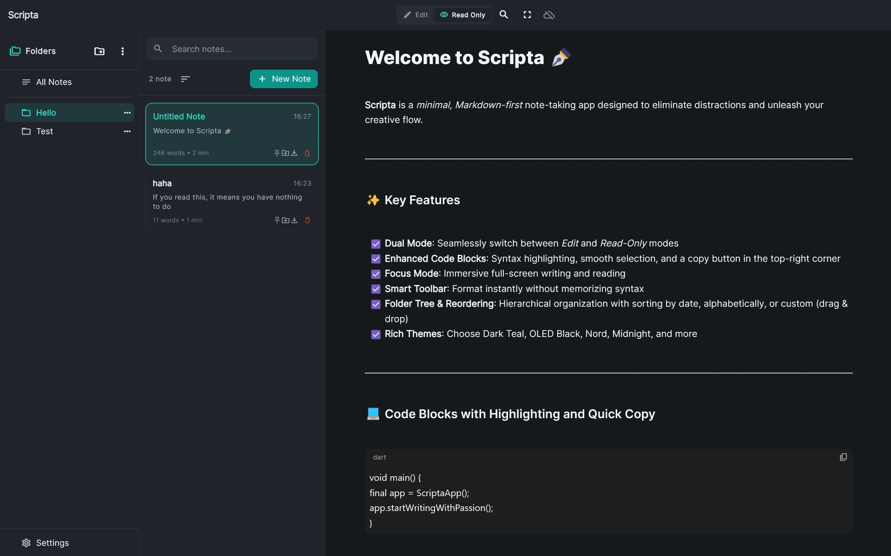
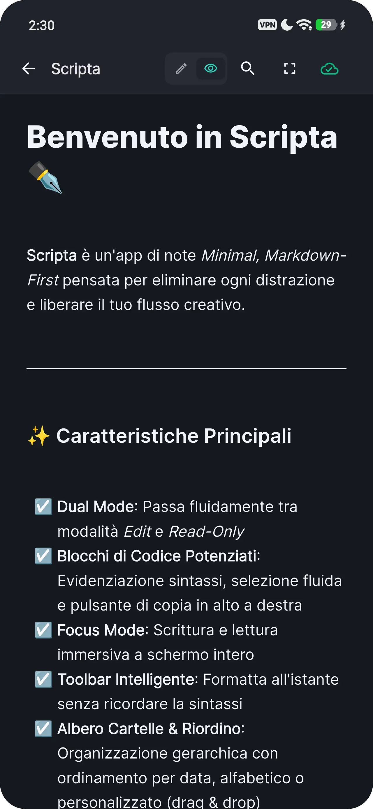

<div align="center">

  

  # Scripta

  **Minimal. Fast. Markdown-First.**  
  *The modern, distraction-free note-taking experience for all your devices.*

  [](https://flutter.dev)
  [](#-supported-platforms)
  [](LICENSE)
  [](#)

</div>

---

## ⚡ What is Scripta?

**Scripta** is an open-source, local-first note-taking application designed for thinkers, writers, and developers. Built from the ground up to be lightweight, instant, and privacy-focused, Scripta gives you complete control over your notes with raw Markdown flexibility and a modern, fluid interface.

Whether you're drafting quick thoughts on your phone or organizing complex projects on your desktop, Scripta stays out of your way and lets your ideas flow.

---

## 📸 Screenshots

<div align="center">

  ### Desktop Experience
  <p align="center">
    
  </p>

  <br />

  ### Mobile Experience
  <p align="center">
    
  </p>

</div>

---

## ✨ Key Features

- **📝 Markdown-First Editor**: Write in clean, standard Markdown with intelligent toolbar helpers, syntax highlighting, and an instant, fluid rendered reading view.
- **⚡ Local-First & Zero Latency**: Instantaneous startup and sub-millisecond search powered by SQLite WAL. Your notes reside on your device, fully accessible offline.
- **🔄 Effortless Synchronization**: Privacy-respecting, asynchronous sync with self-hosted backends using Last-Write-Wins (LWW) conflict resolution and background debouncing.
- **🎨 Modern, Adaptive Design**: Gorgeous light and dark color schemes, custom typography, subtle haptics, and a responsive layout that feels native on desktop, tablet, and mobile.
- **📂 Hierarchical Organization**: Organize notes into nested folders, tag favorites, pin priority documents, and rearrange with drag-and-drop ease.
- **🔍 Instant Search**: Real-time filtering and content search find what you need across your entire vault in milliseconds.
- **📦 True Data Ownership**: Never get locked in. Import and export complete backups anytime with standard ZIP archives or plain Markdown files.
- **⌨️ Desktop-Class Workflow**: Right-click context menus on notes, folders, "All notes" and empty areas (pin, move, duplicate, export, rename, delete, new note/folder, sorting) plus keyboard shortcuts for everything (`F1` shows the full list; `Ctrl` becomes `Cmd` on macOS).

---

## 💻 Supported Platforms

Scripta is engineered as a native multi-platform application with full support across desktop and mobile:

| Platform | Format | Status |
|:---|:---|:---:|
| **Android** | Split APKs & Universal APK | ✅ Supported |
| **Linux** | Native Bundle & Flatpak | ✅ Supported |
| **Windows** | Native x64 & ARM64 Installer | ✅ Supported |
| **macOS** | Universal DMG & ZIP (Intel & Apple Silicon) | ✅ Supported |
| **iOS** | Unsigned IPA (Sideloading ready) | ✅ Supported |

---

## 🚀 Getting Started

Download the latest version for your platform directly from the [Releases](https://github.com/rizzonicola/Scripta/releases) page.

For development instructions or building from source:

```bash
# Clone the repository
git clone https://github.com/rizzonicola/Scripta.git
cd Scripta

# Install dependencies
flutter pub get

# Run tests
flutter test

# Launch the app
flutter run
```

---

## 📄 License

Scripta is free and open-source software licensed under the [GNU General Public License v3.0 (GPLv3)](LICENSE).

---

## ⌨️ Keyboard Shortcuts (Linux / Windows / macOS)

| Action | Shortcut |
|:---|:---|
| New note / New folder | `Ctrl+N` / `Ctrl+Shift+N` |
| Save & sync now | `Ctrl+S` |
| Pin / Move / Duplicate / Export / Delete note | `Ctrl+Shift+P` / `M` / `D` / `E` / `Del` |
| Next / previous note | `Ctrl+PageDown` / `Ctrl+PageUp` |
| Search notes / Find in note | `Ctrl+Shift+F` / `Ctrl+F` |
| Toggle Edit ↔ Read-only | `Ctrl+E` |
| Focus mode / exit | `Ctrl+Shift+Enter` / `Esc` |
| Bold / Italic / Link / Heading 1-3 (editor) | `Ctrl+B` / `I` / `K` / `1`–`3` |
| Settings / Shortcut list | `Ctrl+,` / `F1` |
| System fullscreen | `F11` |

On macOS use `Cmd` instead of `Ctrl`. Right-click a note, a folder (or use its `...` button), *All notes* or any empty area of the sidebar / notes list to open the matching context menu.
